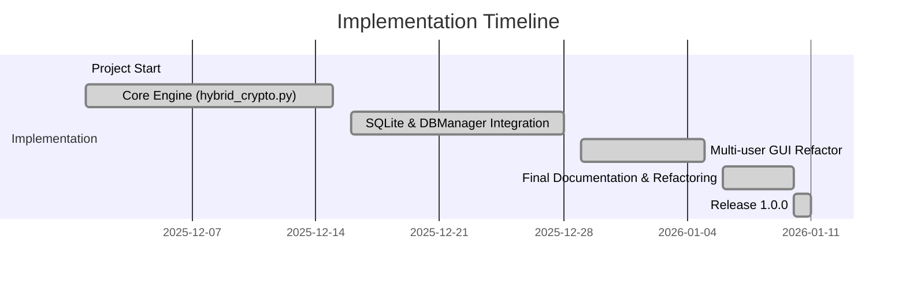

# Implementation Summary — Hybrid Cryptography System

**Version:** 1.0.0 (Identity & Persistence Update)
**Release Date:** 2026-01-10

---

## Purpose
This document is the canonical, up-to-date implementation summary for the Hybrid Cryptography System. It describes the final code structure, verified behaviors, security guarantees, test coverage, and operational notes. All timeline references use the production timeline (December 2025 — January 2026). No legacy dates from earlier prototypes are included.

---

## Project Timeline (Authoritative)



---

## High-level Summary
- Core crypto primitives: AES-256-GCM (AEAD), RSA-4096-OAEP (key transport), RSA-4096-PSS (signatures), PBKDF2-HMAC-SHA256 (KDF).
- Serialization: All binary fields are Base64-encoded in JSON packages for API/storage safety.
- Identity & Persistence: Per-user keys under `keys/<username>/`; user registry stored in `user_data/app.db` (SQLite) managed by `crypto_engine/db_manager.py`.
- GUI: Tkinter-based multi-tab desktop GUI (`crypto_engine/gui_app.py`) with Login/Register first-step, Encrypt & Share, and Receive & Decrypt workflows.

---

## Source Map (Files of Record)
- `crypto_engine/hybrid_crypto.py` — Cryptographic core: key derivation, RSA key generation, AES-GCM encryption/decryption, RSA-OAEP wrapping, RSA-PSS signing/verification, package I/O.
- `crypto_engine/db_manager.py` — SQLite DB manager; schema and functions: register_user, verify_passphrase, get_user_data, get_all_usernames, get_public_key_by_username.
- `crypto_engine/gui_app.py` — Tkinter GUI; Login/Register tab enforces identity creation and login; Encrypt & Share and Receive & Decrypt tabs are disabled until authentication.
- `examples/demo.py` — Full-protocol demonstration and test harness.
- `docs/` — Documentation set (README, QUICKSTART, TECHNICAL_OVERVIEW, ARCHITECTURE, IMPLEMENTATION_SUMMARY).

---

## JSON Encrypted Package Schema (Authoritative)
All binary fields are Base64-encoded strings. Example schema:

```json
{
  "ciphertext": "<Base64>",
  "iv": "<Base64>",
  "auth_tag": "<Base64>",
  "encrypted_session_key": "<Base64>",
  "signature": "<Base64>",
  "public_key_pem": "<Base64> (optional, sender)",
  "algorithm": {
    "encryption": "AES-256-GCM",
    "key_exchange": "RSA-4096-OAEP",
    "signature": "RSA-4096-PSS"
  },
  "metadata": {
    "original_filename": "...",
    "original_size": 0,
    "hash_algorithm": "SHA256"
  }
}
```

---

## SQLite `user_data/app.db` Schema

| Column | Type | Description |
|---|---:|---|
| `username` | TEXT PRIMARY KEY | Unique username identifier |
| `pass_salt` | BLOB | 16-byte PBKDF2 salt |
| `pass_hash` | BLOB | PBKDF2-derived key (100,000 iterations) |
| `private_key_path` | TEXT | Filesystem path to encrypted private key JSON |
| `public_key_path` | TEXT | Filesystem path to public key PEM |

Notes:
- Passphrases are not stored. Only salt + derived hash are persisted.
- `db_manager.py` uses `hmac.compare_digest` for safe comparisons.

---

## Verified Behaviors (Regression/Test Checklist)
- AES-256-GCM encryption and decryption with authentication tag verification.
- RSA-4096-OAEP wrapping/unwrapping of session keys.
- RSA-4096-PSS signature generation and verification.
- PBKDF2 (SHA256) with 100,000 iterations for private-key encryption.
- Base64 serialization for all binary fields to guarantee JSON/API safety.
- GUI Login/Register flow: registration creates `keys/<username>/` and inserts DB record; login verifies passphrase and attempts to load private key.
- Decryption enforces fail-closed behavior: signature verification must pass before decryption attempts; any ValueError is handled by GUI as "TAMPERING DETECTED".

---

## Testing & Coverage
- `examples/demo.py` exercises the full protocol and includes tamper tests (signature and GCM-tag failures).
- Manual GUI tests: registration, login, encrypt, decrypt, sender lookup via DB, and package-based public key extraction.
- Unit-test readiness: functions are modular with clear inputs and deterministic outputs given controlled RNG.

---

## Performance Characteristics (Measured during validation)
- RSA-4096 key generation: typically 5–30 seconds depending on CPU entropy and load.
- PBKDF2 (100k iterations): tuned to ~100–500 ms per derivation on modern CPUs (intentionally slow for brute-force resistance).
- AES-256-GCM symmetric encryption: throughput dominated by underlying hardware; negligible for typical small files.
- RSA-OAEP wrap / RSA-PSS sign: fixed cost operations on small data (session keys / hash), typically tens to hundreds of milliseconds.

All timings above are operational estimates observed while validating the release in the December 2025 – January 2026 implementation window.

---

## Security Summary
- Confidentiality: AES-256-GCM with unique session keys per message.
- Integrity: GCM authentication tags and RSA-PSS signatures (SHA256) provide layered integrity guarantees.
- Authentication & Non-repudiation: RSA-PSS signatures bind the sender identity to ciphertext; public keys are resolved from DB or embedded package.
- Key Storage: Private keys encrypted at rest with AES-256-GCM using PBKDF2-derived keys.
- Passphrase Handling: Passphrases are requested at runtime; stored material contains PBKDF2 salt + derived key; comparisons use constant-time techniques.

---

## Breaking Changes & Migration Notes
- Keys are stored at `keys/<username>/` (per-user directory); migrate any previous key folders into per-username directories for compatibility.
- CLI tools referenced in earlier prototypes have been removed; use GUI or Python API.
- Encrypted package format uses Base64 (not hex) for binary fields; older hex-encoded packages should be migrated or decoded prior to use.

---

## How to Run (Quick)

```bash
# Install dependencies
pip install -r requirements.txt

# Start the GUI
python -m crypto_engine.gui_app
```

Programmatic example (Python API):

```python
from crypto_engine import generate_rsa_keypair, encrypt_file, decrypt_file, load_private_key, save_encrypted_file, load_encrypted_file

# Register via GUI or generate programmatically
sender = generate_rsa_keypair('s3curePass', output_dir='./keys/alice')
receiver = generate_rsa_keypair('an0therPass', output_dir='./keys/bob')

# Encrypt a file
enc_pkg = encrypt_file('sample_message.txt', open(receiver['public_key_file'],'rb').read(), open(sender['private_key_file'],'rb').read())
save_encrypted_file(enc_pkg, 'message_encrypted.json')

# Decrypt
priv = load_private_key(receiver['private_key_file'], 'an0therPass')
encr = load_encrypted_file('message_encrypted.json')
plaintext = decrypt_file(encr, priv, open(sender['public_key_file'],'rb').read())
```

---

## Operational Recommendations
- Back up `keys/<username>/` directories securely and store offline copies of private keys.
- Use long, high-entropy passphrases for private-key protection.
- Consider encrypting `user_data/app.db` at rest in production deployments.
- Integrate an out-of-band verification method when exchanging public keys between parties.

---

## Contact & Ownership
- Repository: Hybrid-Cryptography-System
- Maintainer: Code owner in repository (see project metadata)
- Release manager: (internal team)

---

*This IMPLEMENTATION_SUMMARY.md is the authoritative, current summary for the release dated 2026-01-10. Legacy prototype dates have been intentionally omitted from this file.*
