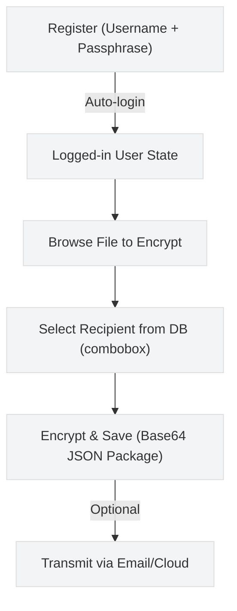

# Quick Start Guide

## Table of Contents
- [Installation](#installation)
- [GUI Quick Start](#gui-quick-start)
- [Python API Quick Start](#python-api-quick-start)
- [Running the Demo](#running-the-demo)
- [Troubleshooting](#troubleshooting)

## Installation

```bash
pip install -r requirements.txt
```

## GUI Quick Start

Start the desktop GUI. The application enforces a Login / Register step before encryption/decryption actions are enabled.

```bash
python -m crypto_engine.gui_app
```

Quick steps (First Flight):



Notes:
- The GUI requires registration or login; Encrypt & Share and Receive & Decrypt tabs are disabled until authentication completes.
- Registration generates a per-user directory under `./keys/<username>/` and stores key paths in the local SQLite DB at `user_data/app.db`.
- On first login after registration the GUI attempts to load and cache the user's private key (requires passphrase to decrypt when used for signing).

Interface walkthrough image: [docs/images/gui_main.png](docs/images/gui_main.png)

## Python API

```python
from crypto_engine import generate_rsa_keypair, encrypt_file, decrypt_file, load_private_key, save_encrypted_file, load_encrypted_file

# Generate keys
sender = generate_rsa_keypair("passphrase")
receiver = generate_rsa_keypair("passphrase")

# Encrypt
encrypted = encrypt_file("file.txt", receiver['public_key_pem'].encode(), sender['private_key_pem'].encode())
save_encrypted_file(encrypted, "encrypted.json")

# Decrypt
key = load_private_key(receiver['private_key_file'], "passphrase")
encrypted = load_encrypted_file("encrypted.json")
plaintext = decrypt_file(encrypted, key, sender['public_key_pem'].encode())
```

## Demo

```bash
python examples/demo.py
```

---

## How It Works

**Encryption:** Generate session key → Encrypt plaintext with AES-256-GCM → Encrypt session key with RSA-4096-OAEP → Sign ciphertext with RSA-4096-PSS → Package (Base64-encoded)

**Decryption:** Verify RSA-PSS signature → Decrypt session key with RSA-4096-OAEP → Decrypt ciphertext with AES-256-GCM & verify auth tag → Plaintext

## Key Management

**GUI:** Use Login/Register tab to create username (generates per-user keys under `./keys/<username>/`)

**Programmatic:**
```python
from crypto_engine import generate_rsa_keypair, load_private_key

keys = generate_rsa_keypair("passphrase", output_dir="./keys/myuser")
priv = load_private_key(keys['private_key_file'], "passphrase")
```

## Best Practices

- Use strong passphrases (16+ chars, mixed case, symbols)
- Protect private key files
- Verify public keys through trusted channels
- Back up encrypted private keys

## Troubleshooting

| Error | Solution |
|-------|----------|
| `ModuleNotFoundError: Cryptodome` | `pip install -r requirements.txt` |
| `Signature verification failed` | Wrong sender public key or data tampering |
| `Failed to decrypt private key` | Incorrect passphrase |
| `Authentication tag verification failed` | File corrupted or tampered |

## Directory Structure

See README.md for full project structure. Key directories:
- `crypto_engine/` – Core modules (hybrid_crypto.py, gui_app.py, db_manager.py)
- `keys/` – Per-user RSA keys (created at registration)
- `user_data/` – SQLite database (created at runtime)
- `examples/` – Demonstration files

## Testing Your Setup

Quick verification:

```python
import sys
sys.path.insert(0, '.')

from crypto_engine import derive_key_from_passphrase

# Test PBKDF2
key, salt = derive_key_from_passphrase("test_passphrase")
print(f"✓ Key derivation works: {len(key)} bytes")

# Test key replication
key2, _ = derive_key_from_passphrase("test_passphrase", salt=salt)
assert key == key2
print(f"✓ Key derivation is deterministic")

print("✓ System is ready!")
```

## Example Output

```
================================================================================
HYBRID CRYPTOGRAPHY SYSTEM - DEMONSTRATION
================================================================================

[STEP 1] Generating RSA-4096 Key Pairs
...
✓ Sender's private key saved (encrypted)
✓ Receiver's private key saved (encrypted)

[STEP 2] Creating Sample Plaintext File
✓ Sample plaintext file created

[STEP 3] ENCRYPTION
✓ Encryption successful!

[STEP 4] DECRYPTION
✓ Decryption successful!
✓ Signature verification PASSED
✓ Authentication tag verification PASSED

[STEP 5] VERIFICATION
✓ SUCCESS: Decrypted message matches original plaintext exactly!
```

## Performance Tips

- **Key generation** takes 5-15 seconds (normal, don't interrupt)
- **Encrypting small files** is fast (< 100ms)
- **Signing** takes 1-2 seconds (RSA-PSS is cryptographically secure)
- **PBKDF2 derivation** takes ~0.5-1 second (security by design)

## Getting Help

- Check **README.md** for API reference
- Review **TECHNICAL_OVERVIEW.md** for cryptographic details
- Run **examples/demo.py** with verbose output
- Check error messages - they're descriptive!


---

**You're ready to use the Hybrid Cryptography System!**
