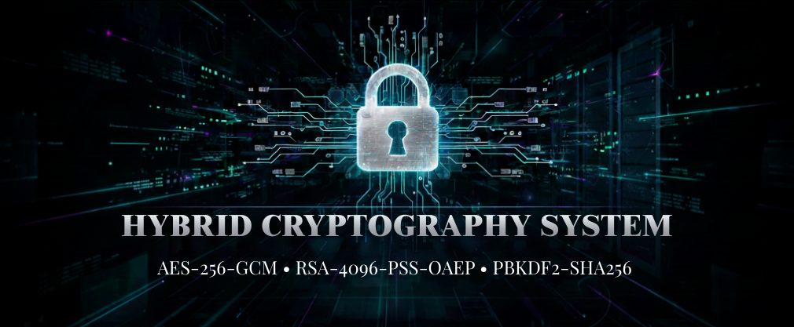

# Hybrid Cryptography System

<div align="center">



[](https://www.python.org/)
[](LICENSE)
[](TECHNICAL_OVERVIEW.md)
[](TECHNICAL_OVERVIEW.md)

**A Hardened Reference Implementation of Authenticated Encryption for Secure Multi-User Workflows**

</div>

---

## Executive Summary

The Hybrid Cryptography System is a secure multi-user cryptographic architecture that combines symmetric (AES-256-GCM) and asymmetric (RSA-4096-OAEP/PSS) cryptography with identity management (SQLite + PBKDF2) to deliver end-to-end encrypted communication with non-repudiation guarantees. The system treats all files as opaque byte streams, enabling **binary-agnostic processing** across any file format without format-specific assumptions.

### Cryptographic Foundation

| Component | Algorithm | Key Size | Mode/Padding | Security Property |
|-----------|-----------|----------|-------------|---------|
| **Confidentiality** | AES | 256 bits | GCM (Galois/Counter, NIST SP 800-38D) | Authenticated encryption; 128-bit auth tag |
| **Session Key Encryption** | RSA | 4096 bits | OAEP with SHA-256 (RFC 8017) | Recipient-only decryption |
| **Authenticity & Non-Repudiation** | RSA | 4096 bits | PSS with SHA-256 (RFC 8017) | Sender signature verification |
| **Key Derivation** | PBKDF2 | - | HMAC-SHA256 (100k iterations, NIST SP 800-132) | Brute-force resistance (~150ms/guess) |

### Architecture Overview

- **Multi-User Identity Layer:** SQLite-backed user registry with PBKDF2-derived passphrase hashes (per-user random salts, constant-time verification)
- **Per-User Key Storage:** Encrypted RSA-4096 private keys stored locally under `./keys/<username>/` with Base64-encoded JSON serialization
- **Embedded Sender Identity:** RSA-4096 public key Base64-encoded and embedded in encrypted packages for seamless verification without external key distribution
- **Dual Tampering Detection:** GCM authentication tag validates ciphertext integrity; RSA-PSS signature validates authenticity and prevents forgery
- **Format-Agnostic Processing:** Binary byte-stream model treats all files identically regardless of extension or MIME type

---

## Table of Contents

1. [Installation](#installation)
2. [Quick Start](#quick-start)
3. [Usage](#usage)
4. [Universal Format Support](#universal-format-support)
5. [JSON Package Schema](#json-package-schema)
6. [API Reference](#api-reference)
7. [Security Properties](#security-properties)
8. [Project Structure](#project-structure)
9. [Getting Help](#getting-help)

---

## Installation

### Requirements

- Python 3.7 or higher
- PyCryptodome 3.18.0+ (pure Python cryptography with side-channel attack mitigations)

### Setup

To install the system, clone the repository from GitHub into your local development environment, navigate to the project directory, and install all required dependencies using the package manager. The installation process will download PyCryptodome and other dependencies listed in the requirements file. Once installation completes, the system is ready for use.

---

## Quick Start

### Graphical Interface (Recommended)

Launch the graphical interface by executing the GUI application module. The application window will open with a user-friendly interface designed for secure communication without requiring command-line expertise.

**Three-Tab Workflow:**

1. **Login / Register:** Create or authenticate as a user; auto-generates RSA-4096 keys in `./keys/<username>/`
2. **Encrypt & Share:** Select plaintext file → Choose receiver from DB → Provide passphrase → Encrypt with full hybrid protocol
3. **Receive & Decrypt:** Load encrypted JSON → Receive public key lookup → Decrypt with tampering detection

### Python API (Programmatic)

Developers can integrate the system programmatically by importing the cryptographic functions from the core module. The typical workflow involves generating RSA-4096 keypairs for both parties, encrypting a file using the recipient's public key while signing with the sender's private key, transmitting the encrypted package, and then decrypting and verifying the file on the receiving end. The system automatically detects tampering attempts and raises security alerts if any verification step fails. All operations are accessible through well-documented functions that handle the complete hybrid encryption pipeline internally.

### Demonstration

To understand the complete encryption and decryption workflow, execute the demonstration script included in the examples directory. This script performs a full end-to-end encryption scenario with multiple verification checkpoints, showing how the system protects against tampering and validates authenticity.

---

## Usage

### GUI Tabs & Workflows

| Tab | Workflow | Key Operations |
|-----|----------|-----------------|
| **Login / Register** | Create user account or authenticate | PBKDF2 key generation → RSA-4096 keypair → DB registration |
| **Encrypt & Share** | Encrypt file for recipient | File selection → AES-256-GCM encryption → RSA-4096-OAEP key wrap → RSA-4096-PSS signature |
| **Receive & Decrypt** | Decrypt and verify received file | JSON load → RSA-PSS signature verification → RSA-4096-OAEP key unwrap → AES-256-GCM decryption |

### Advanced Python API Workflows

For specialized use cases, developers can access lower-level functions to derive encryption keys from passphrases using PBKDF2, inspect file metadata from encrypted packages without performing decryption, and validate package integrity before processing. These functions enable custom workflows such as key management automation, batch processing, and integration with external systems while maintaining security guarantees.

---

## Universal Format Support

**Binary-Agnostic Byte-Stream Processing:** The system treats all files as opaque byte sequences, enabling seamless encryption of any format without format-specific parsing or assumptions.

**Supported Categories:**
- **Text:** Documents, code, configuration, logs (`.txt`, `.md`, `.json`, `.xml`, `.yml`, `.csv`, `.log`)
- **Media:** Images, video, audio (`.jpg`, `.png`, `.gif`, `.mp4`, `.avi`, `.mp3`, `.wav`)
- **Business:** Office documents, archives (`.pdf`, `.docx`, `.xlsx`, `.zip`, `.7z`, `.tar`)
- **System:** Executables, libraries, compiled binaries (`.exe`, `.dll`, `.so`, `.dylib`)
- **Any custom or proprietary binary format**

**Metadata Preservation:** Original filename, MIME type, size, and file extension are recovered post-decryption.

---

## JSON Package Schema

All encrypted packages use Base64-encoded JSON (RFC 4648) for universal API/database compatibility:

```json
{
  "algorithm": {
    "encryption": "AES-256-GCM",
    "key_exchange": "RSA-4096-OAEP",
    "signature": "RSA-4096-PSS",
    "key_derivation": "PBKDF2-HMAC-SHA256"
  },
  "ciphertext": "C7K9mL2p5Q...",
  "iv": "x3hJ8kL2M9+...",
  "auth_tag": "9D2kL8mP3q...",
  "encrypted_session_key": "YbC7dE9fG2...",
  "signature": "JqK8lM3nO5...",
  "public_key_pem": "LS0tLS1CRUdJTi...",
  "metadata": {
    "original_filename": "confidential.pdf",
    "original_size": 1048576,
    "mime_type": "application/pdf",
    "file_extension": "pdf",
    "file_type_category": "document"
  }
}
```

**Field Descriptions:**
- `ciphertext`: AES-256-GCM encrypted plaintext (Base64)
- `iv`: 96-bit initialization vector, randomized per encryption (Base64)
- `auth_tag`: 128-bit authentication tag validating ciphertext integrity (Base64)
- `encrypted_session_key`: 256-bit AES key wrapped with RSA-4096-OAEP (Base64)
- `signature`: Ciphertext signed with RSA-4096-PSS using sender's private key (Base64)
- `public_key_pem`: Sender's RSA-4096 public key in PEM format, Base64-encoded
- `metadata`: Unencrypted but authenticated through RSA-PSS signature

**Encryption Sequence (Alice → Bob):**
1. **Session Key:** Generate 32-byte random key (Ks)
2. **AES-256-GCM:** Encrypt plaintext with Ks + random 96-bit IV → (ciphertext, auth_tag)
3. **RSA-4096-OAEP:** Wrap Ks with Bob's public key → encrypted_session_key
4. **RSA-4096-PSS:** Sign ciphertext with Alice's private key → signature
5. **JSON Serialization:** Base64-encode all binary fields

**Decryption Sequence (Bob receives):**
1. **RSA-4096-PSS Verification:** Verify signature with Alice's embedded public key
2. **RSA-4096-OAEP Unwrap:** Decrypt session key with Bob's private key
3. **AES-256-GCM Decryption:** Decrypt ciphertext + verify auth_tag
4. **Tampering Detection:** Fail fast if any verification step fails

---

## API Reference

### Core Encryption Functions (`crypto_engine.hybrid_crypto`)

| Function | Parameters | Returns | Security Responsibility |
|----------|-----------|---------|------------------------|
| `derive_key_from_passphrase(passphrase, salt=None, key_length=32, iterations=100000)` | `str`, `bytes \| None`, `int`, `int` | `(key: bytes, salt: bytes)` | PBKDF2 key derivation; brute-force resistance |
| `generate_rsa_keypair(passphrase, key_size=4096, output_dir="./keys")` | `str`, `int`, `str` | `Dict[str, str]` | RSA-4096 key generation; private key encryption with derived key |
| `load_private_key(private_key_file, passphrase)` | `str`, `str` | `bytes` | Decrypt private key from disk; passphrase verification |
| `encrypt_file(plaintext_path, receiver_public_key_pem, sender_private_key_pem)` | `str`, `bytes`, `bytes` | `Dict[str, Any]` | Full hybrid encryption: AES-256-GCM + RSA-4096-OAEP + RSA-4096-PSS |
| `decrypt_file(encrypted_package, receiver_private_key_pem, sender_public_key_pem)` | `Dict[str, Any]`, `bytes`, `bytes` | `bytes` | Full hybrid decryption with dual tampering detection |
| `save_encrypted_file(package, path)` | `Dict[str, Any]`, `str` | `None` | Serialize encrypted package to JSON file |
| `load_encrypted_file(path)` | `str` | `Dict[str, Any]` | Deserialize encrypted package from JSON file |
| `get_file_metadata(encrypted_package)` | `Dict[str, Any]` | `Dict[str, Any]` | Extract metadata without decryption |
| `verify_package_integrity(encrypted_package)` | `Dict[str, Any]` | `bool` | Validate all required fields present |

### Database Functions (`crypto_engine.db_manager.DBManager`)

| Method | Parameters | Returns | Security Responsibility |
|--------|-----------|---------|------------------------|
| `register_user(username, passphrase, private_key_path, public_key_path)` | `str`, `str`, `str`, `str` | `None` | PBKDF2 hash derivation; per-user salt generation |
| `get_user_data(username)` | `str` | `Dict \| None` | Retrieve encrypted key paths from SQLite |
| `verify_passphrase(username, passphrase)` | `str`, `str` | `bool` | PBKDF2 constant-time comparison; timing-attack resistance |
| `get_all_usernames()` | (none) | `List[str]` | Return registered users for GUI combobox population |
| `get_public_key_by_username(username)` | `str` | `bytes \| None` | Load public key from disk; no decryption required |

---

## Security Properties

### Confidentiality: AES-256-GCM

- **Cipher:** AES (NIST FIPS 197) with 256-bit keys
- **Mode:** GCM (Galois/Counter Mode per NIST SP 800-38D) with 96-bit random IV
- **Authentication:** 128-bit auth tag detects any ciphertext modification
- **Per-File Randomness:** Unique IV per encryption ensures identical plaintexts produce different ciphertexts
- **Effective Security:** 256-bit symmetric security level

### Authentication & Non-Repudiation: RSA-4096-PSS

- **Key Size:** 4096-bit RSA modulus (~112-bit ECC-equivalent)
- **Scheme:** PSS (Probabilistic Signature Scheme) per RFC 8017
- **Hash:** SHA-256 (512-bit digests)
- **Signed Data:** Ciphertext only (metadata authenticated implicitly through signature)
- **Non-Repudiation:** Sender cannot deny creating signature (private key required)

### Key Wrapping: RSA-4096-OAEP

- **Key Size:** 4096-bit RSA modulus
- **Scheme:** OAEP (Optimal Asymmetric Encryption Padding) per RFC 8017
- **Hash:** SHA-256
- **Session Key:** 256-bit AES key encrypted for recipient only

### Key Derivation: PBKDF2-HMAC-SHA256

- **Standard:** NIST SP 800-132
- **Hash Function:** HMAC-SHA256
- **Iterations:** 100,000 (recommended 2023 minimum per OWASP)
- **Salt:** 32 bytes, cryptographically random per user
- **Derived Key:** 32 bytes (matches AES-256 requirement)
- **Resistance:** ~6 guesses/second on modern CPU (~150ms per derivation)

### Identity Management: SQLite + PBKDF2

- **Storage:** `user_data/app.db` (SQLite3)
- **Passphrase Hashing:** PBKDF2-HMAC-SHA256 with random per-user salts
- **Comparison:** Constant-time hash verification (prevents timing side-channel attacks)
- **Private Key Lifecycle:** Decrypted only after successful login; cleared on logout
- **Access Control:** Filesystem-level per-user directories + DB-level isolation

### Limitations & Known Constraints

| Constraint | Reason | Mitigation |
|-----------|--------|-----------|
| **Files Loaded in Memory** | AES-GCM requires full ciphertext for auth tag verification | Use external tools or HSM integration for streaming |
| **No Key Revocation** | Revoked keys cannot be invalidated retroactively | Implement key versioning + expiration timestamps |
| **No Forward Secrecy** | Session keys stored in encrypted packages indefinitely | Use ephemeral key derivation for ephemeral confidentiality |
| **SQLite Unencrypted** | Database stored on disk as plaintext | Enable full-disk encryption (BitLocker, LUKS, FileVault) |
| **Passphrase Entropy Assumption** | No enforcement of strong passphrases | Add GUI passphrase strength meter; enforce policies |
| **No Multi-Device Support** | Keys stored locally only | Integrate secure key server (HSM, Azure Key Vault) |
| **RSA Quantum Vulnerability** | Post-quantum cryptography not yet standardized | Monitor NIST PQC standardization; plan migration |
| **No Hardware Security Module** | Private keys stored in software memory | Integrate PKCS#11 HSM support for high-security deployments |

---

## Project Structure

```
Hybrid-Cryptography-System/
├── crypto_engine/                    # Main cryptography package
│   ├── __init__.py                   # Public API exports
│   ├── hybrid_crypto.py              # Core engine (AES-256-GCM, RSA-4096, PBKDF2)
│   ├── db_manager.py                 # SQLite user management & key registry
│   ├── gui_app.py                    # Tkinter GUI (Login, Encrypt, Decrypt tabs)
│   └── __pycache__/                  # Python bytecode cache
├── docs/
│   ├── images/
│   │   ├── banner.png                # Project branding banner
│   │   └── gui_main.png              # GUI screenshot (optional)
│   └── ARCHITECTURE.md               # Detailed flow diagrams & design docs
├── examples/
│   ├── demo.py                       # End-to-end encryption/decryption demo
│   ├── sample_message.txt            # Example plaintext
│   ├── message_encrypted.json        # Example encrypted package
│   └── message_decrypted.txt         # Example decrypted output
├── keys/                             # User RSA keypair storage (created at runtime)
│   └── <username>/
│       ├── private_key_encrypted.json # PBKDF2-encrypted RSA-4096 private key
│       └── public_key.pem            # RSA-4096 public key (PEM format)
├── user_data/                        # Database directory (created at runtime)
│   └── app.db                        # SQLite3 user registry
├── scripts/
│   └── cleanup_docs_and_keys.ps1     # PowerShell cleanup utility
├── requirements.txt                  # Python dependencies
├── README.md                         # This file
├── QUICKSTART.md                     # Step-by-step setup guide
├── TECHNICAL_OVERVIEW.md             # Cryptographic algorithm specifications
├── DELIVERABLES.md                   # Feature checklist & implementation status
├── RELEASE_NOTES.md                  # Version history & migration guide
├── LICENSE                           # MIT License
└── .gitignore                        # Git ignore patterns
```

---

## Getting Help

### Common Questions

**Q: How do I start using the system?**  
A: Run `python -m crypto_engine.gui_app` to launch the GUI. Register a user account, then use the Encrypt & Share tab.

**Q: What if I lose my passphrase?**  
A: The private key cannot be recovered without the correct passphrase (PBKDF2 design). You must regenerate keys.

**Q: Can I use the same passphrase for multiple users?**  
A: Technically yes, but not recommended. Each user gets a unique random salt; same passphrase + different salt = different hashes.

**Q: What happens if a file is corrupted during transmission?**  
A: Decryption fails with "Authentication tag verification failed" error—the system detects any bit-flip.

**Q: How do I share a public key with another user?**  
A: Public keys are embedded in encrypted packages automatically. No separate key distribution needed.

### Troubleshooting

| Issue | Cause | Solution |
|-------|-------|----------|
| GUI won't start | Python < 3.7 or PyCryptodome missing | Check `python --version` and `pip install -r requirements.txt` |
| Signature verification failed | Wrong sender public key or tampered file | Verify sender identity; check file wasn't modified |
| Authentication tag verification failed | Ciphertext corrupted or wrong receiver key | Re-download file; verify transmission integrity |
| User already exists | Username taken | Choose a different username |
| Passphrase incorrect error | Wrong passphrase entered | Re-enter passphrase carefully (case-sensitive) |

### Documentation

- **README.md** (this file) — Executive summary & quick reference
- **QUICKSTART.md** — Step-by-step first-time setup
- **TECHNICAL_OVERVIEW.md** — Cryptographic algorithms & security analysis
- **DELIVERABLES.md** — Feature requirements & implementation status
- **RELEASE_NOTES.md** — Version history & breaking changes

### Reporting Issues

Please report bugs or feature requests via GitHub Issues:
- Include Python version (`python --version`)
- Include PyCryptodome version (`pip show pycryptodomex`)
- Provide error message and stack trace
- Describe steps to reproduce
- Include OS and shell information (Windows PowerShell, Linux bash, macOS zsh)

---

## Standards & References

### Cryptographic Standards

- **NIST SP 800-38D** — GCM Mode Specification (Authenticated Encryption)
- **NIST SP 800-132** — PBKDF2 Key Derivation Function
- **NIST FIPS 197** — Advanced Encryption Standard (AES)
- **RFC 8017** — PKCS #1: RSA Cryptography Specifications (PSS, OAEP)

### Security Best Practices

- **OWASP Password Storage Cheat Sheet** — PBKDF2 iteration count guidance
- **OWASP Cryptographic Storage Cheat Sheet** — AES-256-GCM best practices
- **NIST SP 800-175B** — Guidelines for Use of Cryptographic Algorithms

### Python Libraries

- **PyCryptodome 3.18.0+** — Pure Python cryptography with side-channel mitigations
- **Tkinter (stdlib)** — Cross-platform GUI framework
- **SQLite3 (stdlib)** — Embedded relational database

---

## License

This project is licensed under the **MIT License**. See [LICENSE](LICENSE) for details.

---

## Authors & Contact

**Author:** Layba Khan  
**Repository:** [Hybrid-Cryptography-System](https://github.com/Layba-khan01/Hybrid-Cryptography-System)  
**Issues:** [GitHub Issues](https://github.com/Layba-khan01/Hybrid-Cryptography-System/issues)
