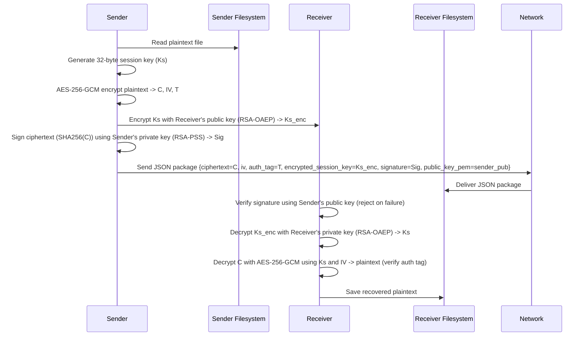

# Hybrid Cryptography System - Technical Overview

## System Architecture

### Core Cryptographic Protocols

#### 1. **AES-256-GCM (Symmetric Encryption)**
- **Mode**: Galois/Counter Mode (GCM)
- **Key Size**: 256 bits
- **Nonce/IV**: 16 bytes (randomly generated per encryption)
- **Output Components**:
  - **C (Ciphertext)**: Encrypted plaintext
  - **IV (Initialization Vector)**: 128-bit nonce
  - **T (Authentication Tag)**: 128-bit authentication tag for GCM

**Why GCM?**
- Provides authenticated encryption (AEAD)
- Prevents tampering via authentication tag verification
- Parallelizable and efficient

#### 2. **RSA-4096-OAEP (Asymmetric Key Exchange)**
- **Key Size**: 4096 bits
- **Padding Scheme**: OAEP (Optimal Asymmetric Encryption Padding)
- **Hash Algorithm**: SHA-256
- **Purpose**: Encrypt AES session key with receiver's public key
- **Why OAEP?**
  - Resistant to padding oracle attacks
  - Provides semantic security
  - Recommended by NIST

#### 3. **RSA-4096-PSS (Digital Signatures)**
- **Key Size**: 4096 bits
- **Padding Scheme**: PSS (Probabilistic Signature Scheme)
- **Hash Algorithm**: SHA-256
- **Signed Data**: Ciphertext (C)
- **Output**: Digital signature for non-repudiation and authenticity

**Why PSS?**
- Probabilistic (randomized) for semantic security
- More resistant to attacks than PKCS#1 v1.5
- NIST/FIPS 186-4 compliant

#### 4. **PBKDF2-SHA256 (Key Derivation)**
- **Algorithm**: PBKDF2 (Password-Based Key Derivation Function 2)
- **Hash Function**: SHA-256
- **Iterations**: 100,000
- **Salt**: 16 bytes (randomly generated per derivation)
- **Output Key Length**: 32 bytes (256 bits for AES-256)

**Purpose**: Derive encryption key from user passphrase for private key storage

## Encryption Protocol Flow

### Step 1: Key Generation
```
User provides passphrase
    ↓
PBKDF2(passphrase, salt, 100k iterations, SHA256) → Master Key (32 bytes)
    ↓
Encrypt: AES-256-GCM(private_key_pem, master_key) → Encrypted Private Key
    ↓
Store: {iv, ciphertext, auth_tag, salt} → JSON file
```

### Step 2: File Encryption (Sender)

```text
Plaintext File
  ↓
[1] Generate random session key (Ks): 32 bytes
  ↓
[2] Encrypt with AES-256-GCM (AEAD)
  Input: Plaintext + Session Key (Ks) + Random IV (16 bytes)
  Output: Ciphertext (C), IV, Authentication Tag (T)
  ↓
[3] Encrypt session key with RSA-4096-OAEP
  Input: Session Key (Ks) + Receiver's Public Key
  Output: Encrypted Session Key (Ks_enc)
  ↓
[4] Sign ciphertext with RSA-4096-PSS
  Input: SHA256(Ciphertext) + Sender's Private Key
  Output: Signature (Sig)
  ↓
Package (JSON with Base64-encoded binary fields):
```

```json
{
  "ciphertext": "<Base64-encoded AES-256-GCM ciphertext>",
  "iv": "<Base64-encoded IV (16 bytes)>",
  "auth_tag": "<Base64-encoded GCM auth tag (16 bytes)>",
  "encrypted_session_key": "<Base64-encoded RSA-OAEP encrypted session key>",
  "signature": "<Base64-encoded RSA-PSS signature of ciphertext>",
  "public_key_pem": "<Base64-encoded sender public key PEM (optional)>",
  "algorithm": {
  "encryption": "AES-256-GCM",
  "key_exchange": "RSA-4096-OAEP",
  "signature": "RSA-4096-PSS"
  },
  "metadata": {
  "original_filename": "document.pdf",
  "original_size": 102400,
  "hash_algorithm": "SHA256"
  }
}
```

All binary values are Base64-encoded to ensure JSON/API safety and compatibility with typical web and storage transports.

#### Sequence Diagram (Sender ↔ Receiver Interactions)



The sequence diagram emphasizes that signature verification is performed before any attempt to decrypt the session key or ciphertext (fail-closed behavior).

### Step 3: File Decryption (Receiver)
```
Encrypted Package
    ↓
[1] VERIFY: RSA-4096-PSS Signature
    Input: Signature + Ciphertext + Sender's Public Key
    Action: Verify signature or REJECT
    ↓
[2] DECRYPT: RSA-4096-OAEP Session Key
    Input: Encrypted Session Key + Receiver's Private Key
    Output: Session Key (Ks) or FAIL
    ↓
[3] DECRYPT & VERIFY: AES-256-GCM Ciphertext
    Input: Ciphertext + IV + Session Key + Authentication Tag
    Action: Decrypt and verify tag or REJECT
    ↓
Output: Plaintext (if all verifications pass)
```

## File Structure

### `crypto_engine/hybrid_crypto.py`
Main cryptographic engine with 8 core functions:

1. **`derive_key_from_passphrase()`**
   - PBKDF2-SHA256 key derivation
   - Input: passphrase, salt (optional), key_length, iterations
   - Output: (derived_key, salt)

2. **`generate_rsa_keypair()`**
   - Generate 4096-bit RSA key pair
   - Encrypt private key with PBKDF2-derived key
   - Store as JSON with AES-256-GCM encryption
   - Output: Dictionary with file paths and PEM format

3. **`load_private_key()`**
   - Load encrypted private key from JSON
   - Decrypt using passphrase-derived key
   - Output: Decrypted private key (bytes)

4. **`encrypt_file()`**
   - Full hybrid encryption protocol
   - Input: plaintext_path, receiver_public_key, sender_private_key
   - Output: Encrypted package dictionary

5. **`decrypt_file()`**
   - Full hybrid decryption with verification
   - Input: encrypted_package, receiver_private_key, sender_public_key
   - Output: Plaintext (bytes) or raises ValueError on verification failure

6. **`save_encrypted_file()`**
   - Serialize encrypted package to JSON file
   - Output: File path

7. **`load_encrypted_file()`**
   - Load encrypted package from JSON file
   - Output: Encrypted package dictionary

8. **`get_file_metadata()`** & **`verify_package_integrity()`**
   - Utility functions for package inspection

### `examples/demo.py`
Comprehensive demonstration script showing:
- RSA keypair generation for sender and receiver
- File encryption with full hybrid protocol
- File decryption with verification
- Tampering detection test
- Metadata extraction

## Security Properties

### Confidentiality
- **AES-256-GCM**: Only receiver with private key can decrypt
- **Session Key Encryption**: Session key protected by RSA-4096
- **Per-file Randomness**: New key, IV, salt for each operation

### Authenticity & Integrity
- **GCM Authentication Tag**: Detects any ciphertext tampering
- **RSA-PSS Signature**: Proves message from sender
- **Signature Verification**: Required before decryption

### Non-repudiation
- **Sender's Private Key Signature**: Sender cannot deny encryption
- **Sender's Public Key Verification**: Receiver verifies sender identity

### Key Security
- **PBKDF2 Derivation**: Resists dictionary/brute-force attacks
- **100,000 Iterations**: ~500ms computation per derivation
- **16-byte Salt**: Ensures uniqueness

## Threat Protection

| Threat | Protection |
|--------|-----------|
| Eavesdropping | AES-256-GCM encryption |
| Tampering | GCM authentication tag |
| Forgery | RSA-PSS digital signature |
| Brute-force | PBKDF2 with 100k iterations |
| Replay attacks | New nonce/IV per message |
| Key recovery | 4096-bit RSA + PBKDF2 |

## Performance Characteristics

### Time Complexity
- RSA-4096 Keypair: 5-15 seconds
- RSA-4096-PSS Sign: 1-2 seconds
- RSA-4096-OAEP Encrypt: ~10-50ms
- PBKDF2 Derivation: 0.5-1 second
- AES-256-GCM Encrypt: 100-200 MB/s (small files)

### Space Complexity
- RSA-4096 Private Key: ~3.3 KB (PEM format)
- RSA-4096 Public Key: ~0.9 KB (PEM format)
- Encrypted Package Overhead: ~512 bytes + encrypted session key
- Signature Size: 512 bytes (4096-bit RSA)

## Encryption Example Output

```json
{
  "ciphertext": "a1b2c3d4...",
  "iv": "deadbeef...",
  "auth_tag": "cafebabe...",
  "encrypted_session_key": "f00dba11...",
  "signature": "baadf00d...",
  "public_key_pem": "LS0tLS1CRUdJTiBQVUJMSUMgS0VZLS0tLS0KTUlJQkl...",
  "algorithm": {
    "encryption": "AES-256-GCM",
    "key_exchange": "RSA-4096-OAEP",
    "signature": "RSA-4096-PSS"
  },
  "metadata": {
    "original_filename": "document.pdf",
    "original_size": 102400,
    "file_type": "documents",
    "extension": ".pdf",
    "mime_type": "application/pdf",
    "hash_algorithm": "SHA256"
  }
}
```

**Key Features:**
- **`public_key_pem` (Base64):** Sender's public key embedded for seamless verification
- **File Type Detection:** Metadata includes file category, extension, and MIME type
- **All Binary Fields Base64-Encoded:** Safe for JSON transmission via APIs and databases

## Error Handling

### Signature Verification Failure
```
Error: "Signature verification failed. Data may have been tampered with."
Cause: Message altered or wrong sender public key
Action: Reject decryption, investigate tampering
```

### Authentication Tag Verification Failure
```
Error: "Authentication tag verification failed. Ciphertext may be corrupted or tampered."
Cause: Ciphertext corrupted or wrong session key
Action: Reject decryption
```

### Passphrase Incorrect
```
Error: "Failed to decrypt private key. Passphrase may be incorrect."
Cause: Wrong passphrase provided
Action: Request correct passphrase
```

## Usage Pattern

```python
# 1. Generate keys once
sender_keys = generate_rsa_keypair("passphrase")
receiver_keys = generate_rsa_keypair("passphrase")

# 2. Exchange public keys
# (send sender_keys['public_key_pem'] and receiver_keys['public_key_pem'])

# 3. Sender encrypts
encrypted = encrypt_file(
    "document.txt",
    receiver_keys['public_key_pem'].encode(),
    sender_keys['private_key_pem'].encode()
)

# 4. Receiver decrypts
private_key = load_private_key(receiver_keys['private_key_file'], "passphrase")
plaintext = decrypt_file(
    encrypted,
    private_key,
    sender_keys['public_key_pem'].encode()
)
```

## Standards Compliance

- **PBKDF2**: RFC 2898, NIST SP 800-132
- **AES-GCM**: NIST SP 800-38D, FIPS 197
- **RSA-OAEP**: RFC 8017, FIPS 186-4
- **RSA-PSS**: RFC 8017, FIPS 186-4
- **SHA-256**: FIPS 180-4

## Limitations & Future Enhancements

### Current Limitations
1. Entire file loaded into memory (not streaming)
2. Passphrase recovery not implemented
3. No key revocation system
4. Single-user key storage (no central key server)

### Supported File Types
The system treats all files as opaque binary data, supporting:
- **Text**: `.txt`, `.md`, `.csv`, `.json`, `.xml`, `.log`, `.yml`, `.yaml`, `.ini`, `.cfg`
- **Images**: `.jpg`, `.jpeg`, `.png`, `.gif`, `.bmp`, `.tiff`, `.tif`, `.webp`, `.ico`
- **Documents**: `.pdf`, `.docx`, `.xlsx`, `.pptx`, `.doc`, `.xls`, `.ppt`, `.odt`, `.rtf`
- **Videos**: `.mp4`, `.avi`, `.mov`, `.mkv`, `.flv`, `.wmv`, `.webm`, `.m4v`, `.3gp`
- **Audio**: `.mp3`, `.wav`, `.flac`, `.aac`, `.ogg`, `.wma`, `.alac`, `.opus`, `.m4a`
- **Archives**: `.zip`, `.rar`, `.7z`, `.tar`, `.gz`, `.bz2`, `.xz`, `.iso`
- **Executables**: `.exe`, `.dll`, `.so`, `.dylib`, `.app`, `.bin`
- **Code**: `.py`, `.js`, `.java`, `.cpp`, `.c`, `.go`, `.rs`, `.php`, `.rb`
- **Any other binary file type**

### Potential Enhancements
1. Streaming encryption/decryption for large files
2. Certificate-based key distribution (X.509)
3. Key server/directory integration
4. Hardware security module (HSM) support
5. Multi-recipient encryption
6. Key expiration and revocation
5. Multi-recipient encryption

---

**Built with PyCryptodome** - A self-contained pure-Python implementation of cryptographic algorithms.
## Implementation Details and Function Reference

This section consolidates concrete implementation notes, function signatures and outputs to make `TECHNICAL_OVERVIEW.md` the single deep-dive reference for developers.

### Core Functions (signatures and behavior)

1. `derive_key_from_passphrase(passphrase: str, salt: Optional[bytes]=None, key_length: int=32, iterations: int=100000) -> Tuple[bytes, bytes]`
    - Derives a 32-byte key (default) using PBKDF2-HMAC-SHA256.
    - If `salt` is None a 16-byte random salt is generated.
    - Returns `(derived_key, salt)` where `derived_key` is bytes suitable for AES-256.

2. `generate_rsa_keypair(passphrase: str, key_size: int=4096, output_dir: str='./keys') -> Dict[str, str]`
    - Generates a 4096-bit RSA keypair.
    - Private key is encrypted with AES-256-GCM using a PBKDF2-derived key from the provided `passphrase`.
    - Stored output includes encrypted private key JSON and public key PEM file.
    - Returns dictionary with keys: `private_key_file`, `public_key_file`, `private_key_pem`, `public_key_pem`, `salt`.

3. `load_private_key(private_key_file: str, passphrase: str) -> bytes`
    - Loads the encrypted private key JSON, derives the AES key via PBKDF2, decrypts the private key with AES-256-GCM and returns the private key bytes (PEM).

4. `encrypt_file(plaintext_path: str, receiver_public_key_pem: bytes, sender_private_key_pem: bytes) -> Dict[str, Any]`
    - Implements the hybrid protocol:
      - Generate random 32-byte session key Ks
      - AES-256-GCM encrypt plaintext → ciphertext (hex), iv (hex), auth_tag (hex)
      - RSA-4096-OAEP encrypt session key → encrypted_session_key (hex)
      - RSA-4096-PSS sign ciphertext → signature (hex)
    - Returns JSON-serializable dictionary with fields: `ciphertext`, `iv`, `auth_tag`, `encrypted_session_key`, `signature`, `algorithm`, `metadata`.

5. `decrypt_file(encrypted_package: Dict[str, Any], receiver_private_key_pem: bytes, sender_public_key_pem: bytes) -> bytes`
    - Verification-first decryption flow:
      - Verify RSA-PSS signature against ciphertext using `sender_public_key_pem`. If verification fails, raise `ValueError("Signature verification failed")`.
      - Decrypt encrypted session key using RSA-OAEP with `receiver_private_key_pem`.
      - Decrypt ciphertext with AES-256-GCM using the session key, iv and auth_tag. If tag verification fails raise `ValueError("Authentication tag verification failed")`.
      - Return plaintext bytes on success.

6. Utility functions: `save_encrypted_file()`, `load_encrypted_file()`, `get_file_metadata()`, `verify_package_integrity()`

### File Formats

#### Encrypted Private Key JSON
Stores RSA private key encrypted with AES-256-GCM and PBKDF2-derived passphrase:
```json
{
  "iv": "Base64-encoded IV (16 bytes)",
  "ciphertext": "Base64-encoded encrypted private key",
  "auth_tag": "Base64-encoded GCM auth tag (16 bytes)",
  "salt": "Base64-encoded PBKDF2 salt (16 bytes)",
  "algorithm": "AES-256-GCM",
  "kdf": "PBKDF2-SHA256"
}
```

#### Encrypted Package (File Encryption Output)
All binary data is **Base64-encoded** for JSON and API compatibility:
```json
{
  "ciphertext": "Base64-encoded AES-256-GCM ciphertext",
  "iv": "Base64-encoded initialization vector (16 bytes)",
  "auth_tag": "Base64-encoded GCM authentication tag (16 bytes)",
  "encrypted_session_key": "Base64-encoded RSA-4096-OAEP encrypted AES key",
  "signature": "Base64-encoded RSA-4096-PSS signature of ciphertext",
  "algorithm": {
    "encryption": "AES-256-GCM",
    "key_exchange": "RSA-4096-OAEP",
    "signature": "RSA-4096-PSS"
  },
  "metadata": {
    "original_filename": "source.txt",
    "original_size": 1024,
    "hash_algorithm": "SHA256"
  }
}
```

**Base64 Encoding Rationale:**
- ✅ JSON-safe: All byte strings encoded without escape sequences
- ✅ API-ready: Compatible with REST APIs, webhooks, databases
- ✅ Human-readable: Easy inspection and debugging
- ✅ Standard: Industry-standard encoding (RFC 4648)

### Testing and Demonstration

- The `examples/demo.py` (or `examples/run_full_protocol_demo.py` for an alternate runner) scripts exercise the full flow: key generation, sample plaintext creation, encryption, decryption, tamper test, and verification outputs.
- The demo asserts plaintext equality after decrypting and demonstrates explicit handling of signature failures and GCM tag failures.

### Performance Notes

- RSA-4096 key generation dominates runtime for one-time setup (5–15s typical). Consider generating keys offline.
- PBKDF2 with 100k iterations is intentionally slowed to resist brute-force; tune only with awareness of security trade-offs.

### Code Quality and Security Practices (summary)

- Clear separation of responsibilities (KDF, key storage, encryption, verification).
- Defensive programming: all verification steps raise descriptive exceptions; plaintext never returned if any verification fails.
- **Base64 encoding**: All binary data (ciphertext, keys, signatures) is Base64-encoded for JSON serialization, ensuring safe transmission via APIs and databases without encoding issues.

---

For more concrete examples and usage patterns, consult `examples/demo.py` and the `crypto_engine/hybrid_crypto.py` docstrings.
