# Hybrid Cryptography System: Architecture & Security Design

**Document Version:** 1.0  
**Last Updated:** January 2026  
**System:** Hybrid Cryptography System with AES-256-GCM, RSA-4096 (OAEP/PSS), and PBKDF2

---

## Table of Contents

1. [Executive Summary](#executive-summary)
2. [High-Level Logic Flow](#high-level-logic-flow)
3. [User Identity & Database Lifecycle](#user-identity--database-lifecycle)
4. [Cryptographic Decision Log](#cryptographic-decision-log)
5. [Error Handling & Security Guards](#error-handling--security-guards)
6. [Data Lifecycle & Threat Model](#data-lifecycle--threat-model)

---

## Executive Summary

The Hybrid Cryptography System combines **symmetric encryption** (AES-256-GCM), **asymmetric encryption** (RSA-4096-OAEP), and **digital signatures** (RSA-4096-PSS) to provide confidentiality, integrity, and non-repudiation for sensitive data. The system employs a **fail-closed design** where any cryptographic anomaly triggers a security alert and prevents data leakage.

**Core Security Properties:**
- **Confidentiality:** AES-256-GCM encrypts plaintext with authenticated encryption
- **Integrity:** RSA-PSS signatures authenticate ciphertext; GCM tags detect corruption
- **Key Exchange:** RSA-OAEP prevents key recovery attacks
- **Authentication:** PBKDF2 resists brute-force attacks on user passphrases
- **Non-Repudiation:** Sender signature proves message origin

---

## High-Level Logic Flow

### A. Encryption Pipeline (Sender Side)

The following diagram illustrates the complete encryption workflow from plaintext to a Base64-encoded JSON package ready for secure transmission:

```mermaid
graph LR
    A["📄 Plaintext File<br/>(Any Type)"] -->|Read| B["📊 Plaintext Bytes<br/>(Binary Data)"]
    B -->|Random 256-bit| C["🔑 Generate Session Key<br/>(Ks)"]
    C -->|AES-256-GCM<br/>+ IV + Auth| D["🔒 AES Encryption<br/>C, IV, Auth_Tag"]
    D -->|RSA-4096-OAEP<br/>Receiver Pub| E["🔐 RSA Key Wrap<br/>Ks_enc"]
    E -->|RSA-4096-PSS<br/>Sender Priv| F["✍️ Digital Signature<br/>Sig = Sign(C)"]
    F -->|Base64 Encoding| G["📦 JSON Package<br/>Ciphertext, Keys,<br/>Signature, Metadata"]
    G -->|📤 Transmit| H["☁️ Untrusted Channel<br/>(Network, Email, Cloud)"]
    
    style A fill:#e1f5ff
    style B fill:#e1f5ff
    style C fill:#fff3e0
    style D fill:#f3e5f5
    style E fill:#f3e5f5
    style F fill:#e8f5e9
    style G fill:#fce4ec
    style H fill:#ffebee
```



**Pipeline Stages:**

1. **Read Plaintext:** File loaded into memory as binary data (supports all file types)
2. **Generate Session Key:** 256-bit random key via `get_random_bytes(32)`
3. **AES-256-GCM Encryption:** 
   - Plaintext encrypted with session key
   - IV (nonce): 16-byte random value
   - Produces: Ciphertext (C) + Authentication Tag (T)
4. **RSA-OAEP Key Wrap:**
   - Session key encrypted with receiver's public key
   - Produces: Encrypted Session Key (Ks_enc)
5. **RSA-PSS Signature:**
   - SHA256 hash of ciphertext computed
   - Signature created using sender's private key
   - Produces: Digital Signature (Sig)
6. **JSON Package:**
   - All binary data encoded as Base64
   - Metadata includes original filename, size, algorithm identifiers
7. **Transmission:** Package sent via untrusted channel (email, cloud, network)

---

### B. Decryption Pipeline (Receiver Side)

The following diagram shows the verification and decryption workflow, implementing strict fail-closed design:

```mermaid
graph LR
    A["📦 Received JSON Package"] -->|Parse Base64| B["🔓 Extract Components<br/>C, IV, T, Ks_enc, Sig"]
    B -->|Sender Pub Key| C{{"🔍 Verify<br/>RSA-PSS Signature<br/>on C"}}
    C -->|❌ FAIL| D["🚨 TAMPERING DETECTED<br/>Alert & Reject"]
    C -->|✅ PASS| E["🔑 Decrypt Session Key<br/>RSA-4096-OAEP<br/>Receiver Priv"]
    E -->|Ks + IV| F["🔓 Decrypt Ciphertext<br/>AES-256-GCM"]
    F -->|Verify Auth Tag| G{{"🔐 Check<br/>GCM Auth Tag"}}
    G -->|❌ FAIL| H["🚨 TAMPERING DETECTED<br/>Integrity Failure"]
    G -->|✅ PASS| I["📄 Plaintext<br/>(Decrypted File)"]
    I -->|💾 Save| J["✅ File Recovered<br/>with Integrity"]
    
    style A fill:#fce4ec
    style B fill:#fce4ec
    style C fill:#fff3e0
    style D fill:#ffcdd2
    style E fill:#f3e5f5
    style F fill:#f3e5f5
    style G fill:#fff3e0
    style H fill:#ffcdd2
    style I fill:#e1f5ff
    style J fill:#c8e6c9
```



**Pipeline Stages (Fail-Closed Design):**

1. **Load & Parse:** JSON package loaded and Base64 components decoded
2. **Signature Verification (PRIMARY GATE):**
   - RSA-PSS signature verified using sender's public key
   - If verification fails → **TAMPERING DETECTED** alert, process halted
   - Prevents decryption of tampered data
3. **Session Key Decryption:**
   - Encrypted session key unwrapped using receiver's private key
   - If decryption fails → **ValueError** raised, caught by GUI
4. **Ciphertext Decryption:**
   - AES-256-GCM decrypts ciphertext with recovered session key and IV
5. **Authentication Tag Verification (SECONDARY GATE):**
   - GCM authentication tag verified
   - If verification fails → **TAMPERING DETECTED**, ValueError propagates
   - Ensures ciphertext integrity before plaintext release
6. **Plaintext Recovery:**
   - Only if both signature AND tag verification succeed
   - File saved to disk with original filename preserved in metadata

---

## User Identity & Database Lifecycle

### Registration / Login Flow

The following sequence diagram illustrates the interaction between GUI, DBManager, and file system during user registration and login:


**Key Flow Points:**

1. **Registration:**
   - User provides username & passphrase
   - RSA-4096 keypair generated (`generate_rsa_keypair`)
   - Private key encrypted with PBKDF2-derived key and stored as JSON
   - Public key stored as plain PEM file
   - User record inserted into SQLite DB with salted passphrase hash

2. **Login:**
   - User provides username & passphrase
   - DBManager retrieves salt and hash from DB
   - Passphrase verified via PBKDF2 + HMAC-secure comparison
   - If correct, private key decrypted and cached in GUI memory
   - Subsequent encryption/decryption uses cached key

---

### Database Schema

| Column              | Type    | Description                                      |
|---------------------|---------|--------------------------------------------------|
| `username`          | TEXT    | Primary key; unique username identifier          |
| `pass_salt`         | BLOB    | 16-byte salt for PBKDF2 key derivation           |
| `pass_hash`         | BLOB    | SHA256-HMAC(PBKDF2(passphrase, salt), ...)       |
| `private_key_path`  | TEXT    | Filesystem path to encrypted private key JSON    |
| `public_key_path`   | TEXT    | Filesystem path to public key PEM file           |

**Security Notes:**
- Passphrases are **never stored**; only PBKDF2-derived hashes with salts
- Private keys are encrypted at rest using AES-256-GCM
- Public keys stored in plain PEM format (non-sensitive)
- Passphrase verification uses `hmac.compare_digest()` to prevent timing attacks

---

## Cryptographic Decision Log

### Why These Algorithms?

| Algorithm/Parameter | Choice | Rationale |
|---|---|---|
| **Symmetric Encryption** | AES-256-GCM | NIST standard, 256-bit key resists brute-force, GCM mode provides authenticated encryption (confidentiality + integrity in one operation), 128-bit authentication tag prevents forgery |
| **AES Key Size** | 256 bits (32 bytes) | Exceeds NIST post-quantum recommendations; reserves security margin against quantum threats (Grover's algorithm would require ~$2^{128}$ operations) |
| **AES IV (Nonce)** | 16 bytes (96 bits) | Random per-message, prevents IV reuse attacks; 96-bit length optimal for GCM performance per NIST SP 800-38D |
| **Asymmetric Encryption** | RSA-4096-OAEP | 4096-bit RSA provides ~128-bit symmetric strength; OAEP padding prevents chosen-ciphertext attacks (IND-CCA2 secure); 4096-bit size accounts for advances in factorization algorithms |
| **RSA Padding (Decryption)** | PKCS#1 v2.1 OAEP | Replaces vulnerable PKCS#1 v1.5; OAEP adds randomness, prevents Bleichenbacher attacks; SHA256 hash function ensures security level matches RSA modulus |
| **Digital Signatures** | RSA-4096-PSS | PSS padding provides IND-CMA security (existentially unforgeable); probabilistic padding prevents signature forgery via multiple hash computations |
| **RSA Padding (Signature)** | PSS with SHA256 | Deterministic padding would leak information; PSS randomization prevents multi-target attacks; SHA256 output (32 bytes) sufficient for 4096-bit security margin |
| **Key Derivation** | PBKDF2 with SHA256 | 100,000 iterations resists dictionary/brute-force attacks; NIST-approved; cost tuned to ~100ms per passphrase (acceptable UX delay while maintaining security); SHA256 output size (32 bytes) matches AES-256 |
| **PBKDF2 Iterations** | 100,000 | Tuned per OWASP recommendations for 2023+; ~100ms computation time on modern hardware; raises cost of offline dictionary attack by factor of 100,000× versus plaintext passphrases |
| **Hash Function** | SHA-256 | FIPS 180-4 standard; 256-bit output provides 128-bit security level; collision resistance adequate for signing and HMAC operations |
| **HMAC for Passphrase Verification** | HMAC-SHA256 | Timing-attack resistant comparison; prevents discrepancies from leaking passphrase length or partial correctness |
| **Random Number Generation** | `Cryptodome.Random` | Cryptographically secure; uses OS entropy pool; suitable for IV, salt, and session key generation |

---

### Hybrid Model Justification

Why combine symmetric + asymmetric encryption?

| Aspect | Symmetric Only | Asymmetric Only | **Hybrid (Ours)** |
|---|---|---|---|
| **Speed** | ✅ Fast (~1 GB/s) | ❌ Slow (~10 MB/s) | ✅ Fast (AES dominates) |
| **Key Exchange** | ❌ Pre-shared key required | ✅ Public key distribution | ✅ Scalable via PKI |
| **Storage** | ✅ Efficient | ❌ Expensive (4096-bit keys) | ✅ Minimal ciphertext overhead |
| **Scalability** | ❌ N² key pairs needed | ✅ Infrastructure-friendly | ✅ Best of both |
| **Signature Support** | ❌ HMAC only (not binding) | ✅ Non-repudiation | ✅ Full non-repudiation |

---

## Error Handling & Security Guards

### The "Fail-Closed" Design

The system implements strict error propagation to prevent partial data leakage:

#### Guard 1: Signature Verification (Primary)

```python
# File: crypto_engine/hybrid_crypto.py, decrypt_file()
try:
    pss.new(sender_public_key).verify(hash_obj, signature)
except ValueError as e:
    raise ValueError("Signature verification failed. Data may have been tampered with.") from e
```

**Security Property:** If signature verification fails, decryption is **never attempted**. The GUI catches this `ValueError` and displays the alert:

```
🚨 TAMPERING DETECTED: Signature verification failed.
```

**Threat Model:**
- **MITM Attack:** Attacker intercepts ciphertext and modifies bytes
- **Malicious Actor:** Insider modifies encrypted package
- **Bit Flip:** Random bit flip during transmission (cosmic ray, storage error)

→ **Result:** Signature verification fails; no plaintext released.

---

#### Guard 2: Authentication Tag Verification (Secondary)

```python
# File: crypto_engine/hybrid_crypto.py, decrypt_file()
try:
    plaintext = cipher_aes.decrypt_and_verify(ciphertext, auth_tag)
except ValueError as e:
    raise ValueError("Authentication tag verification failed. Ciphertext may be corrupted or tampered.") from e
```

**Security Property:** Even if signature passes (edge case: sender's key compromised), GCM authentication tag provides a second, independent integrity check.

**Threat Model:**
- Ciphertext corrupted during storage/transmission
- Weak key derivation led to incorrect session key (key is close but wrong)
- GCM ensures plaintext decryption fails if ciphertext was modified

→ **Result:** Authentication failure; ValueError caught, alert displayed.

---

#### Guard 3: GUI Exception Handling

```python
# File: crypto_engine/gui_app.py, _on_load_and_decrypt()
try:
    plaintext_bytes = decrypt_file(encrypted_pkg, receiver_priv_pem, sender_pub_pem)
except ValueError:
    messagebox.showerror('TAMPERING DETECTED', 
        'TAMPERING DETECTED: Signature or authentication tag verification failed.')
    return
except Exception as e:
    messagebox.showerror('Error', f'Decryption failed:\n{e}')
    return
```

**Security Property:**
- All `ValueError` exceptions from crypto engine treated as security incidents
- GUI **never** processes partial decrypted data
- User receives explicit security alert (blocking messagebox)
- Process terminates cleanly; no data written to disk

---

### Security Invariants

The system maintains the following invariants:

| Invariant | Guarantee | Mechanism |
|---|---|---|
| **No Plaintext Without Signature** | Signature verified before any decryption attempted | RSA-PSS verification in `decrypt_file()` is first step |
| **No Partial Decryption** | If either GCM or PSS verification fails, plaintext discarded | `decrypt_and_verify()` and `verify()` are atomic operations |
| **Passphrases Never Logged** | User passphrases not written to disk or logs | PBKDF2 hash stored; passphrase only in RAM during key derivation |
| **Private Keys Encrypted at Rest** | Unencrypted private keys never touch filesystem | `generate_rsa_keypair()` immediately encrypts before writing |
| **Session Keys Unique Per Message** | No two messages share the same AES session key | `get_random_bytes(32)` generates fresh 256-bit key per `encrypt_file()` call |
| **Deterministic Verification** | Passphrase verification uses timing-attack-resistant comparison | `hmac.compare_digest()` compares all 32 bytes before returning |

---

## Data Lifecycle & Threat Model

### End-to-End Data Flow


### Threat Model & Mitigations

| Threat | Attacker Model | Risk | Mitigation |
|---|---|---|---|
| **Ciphertext Tampering** | MITM, Insider | Attacker modifies bytes in JSON package | RSA-PSS signature verification detects any bit flip |
| **Key Substitution** | Attacker replaces receiver's public key | Attacker intercepts and re-encrypts with their key | Out-of-band public key verification (assumed); DB lookup validates key ownership |
| **Session Key Recovery** | Attacker intercepts Ks_enc | Session key encrypted with RSA-4096-OAEP; requires private key to recover | Receiver holds private key; OAEP prevents chosen-ciphertext attacks |
| **Signature Forgery** | Attacker creates fake signature | Attacker claims message from legitimate sender | PSS padding + 4096-bit RSA makes forgery computationally infeasible |
| **Passphrase Brute Force** | Offline attack on private_key_encrypted.json | 100,000 PBKDF2 iterations delay each attempt | ~100ms per attempt; 10^15 attempts required for weak passphrase; impractical |
| **Plaintext Side-Channel** | Cache/timing analysis during decryption | Attacker observes decryption time to infer plaintext properties | Constant-time AES-GCM (hardware-accelerated); GCM tag verification atomic |
| **Replay Attack** | Attacker resends old ciphertext | Receiver decrypts same message twice, unaware of replay | Lack of timestamp/nonce in ciphertext allows replay; recommend message counter in metadata (future enhancement) |
| **Key Deletion Failure** | User loses private key file | No recovery possible; data becomes unrecoverable | User responsibility; system assumes key backup outside scope |
| **DB Compromise** | Attacker gains access to user_data/app.db | Attacker reads passphrase hashes and key paths | Hashes stored with salt; HMAC-SHA256 resists cracking. Private keys still encrypted. Recommend: encrypt entire DB at rest (future) |
| **Memory Disclosure** | Attacker dumps process memory | Private key and session keys visible in RAM | Assume trusted execution environment; post-decryption cleanup recommended (future: `secrets` module + memory wiping) |

---

## Implementation Notes

### File Structure

```
crypto_engine/
├── hybrid_crypto.py      # Core cryptography engine
├── gui_app.py            # Tkinter GUI implementation
└── db_manager.py         # SQLite user & key management

keys/
├── <username_1>/
│   ├── private_key_encrypted.json  # AES-256-GCM encrypted
│   └── public_key.pem              # Plain PEM format
└── <username_2>/
    └── ...

user_data/
└── app.db                # SQLite DB with users table
```

### Key Performance Characteristics

| Operation | Timing | Notes |
|---|---|---|
| **Generate RSA-4096** | ~10-30 seconds | One-time cost; happens during registration |
| **PBKDF2 (100k iterations)** | ~100 ms | Per passphrase derivation (registration, decryption unlock) |
| **AES-256-GCM (1 GB file)** | ~1 second | Symmetric encryption dominates; hardware-accelerated on modern CPUs |
| **RSA-4096-OAEP Key Wrap** | ~100 ms | Wrap single 32-byte session key; not a bottleneck |
| **RSA-4096-PSS Signature** | ~150 ms | Sign SHA256 hash; fixed cost regardless of message size |
| **RSA-4096-PSS Verify** | ~50 ms | Verify signature; faster than signing |

---

## Future Hardening Recommendations

1. **Post-Quantum Cryptography:** Migrate to CRYSTALS-Kyber (key exchange) + CRYSTALS-Dilithium (signatures) when standards finalize
2. **Encrypted Database:** Encrypt entire SQLite DB at rest with master key
3. **Memory Wiping:** Use `secrets` module or `nacl.sodium` for secure memory cleanup post-decryption
4. **Timestamp & Counter:** Add message counter to metadata to prevent replay attacks
5. **Hardware Security Module (HSM):** Store root keys in HSM for enterprise deployments
6. **Certificate-Based PKI:** Transition from plaintext public key files to X.509 certificates with CA verification
7. **Audit Logging:** Log all cryptographic operations for forensic analysis
8. **Rate Limiting:** Implement login attempt throttling to slow brute-force attacks

---

## References

- **NIST SP 800-38D:** Recommendation for Block Cipher Modes of Operation: Galois/Counter Mode (GCM) and GMAC
- **NIST FIPS 186-4:** Digital Signature Standard (DSS) – RSA-PSS
- **RFC 3394:** AES Key Wrap Algorithm
- **RFC 2898:** PKCS #5: Password-Based Cryptography Specification Version 2.0 (PBKDF2)
- **OWASP:** Password Storage Cheat Sheet (iteration count recommendations)
- **PyCryptodome Documentation:** https://www.dlitz.net/software/pycryptodome/

---

**Document Confidentiality:** Internal Technical Documentation  
**Audience:** Developers, Security Auditors, System Architects
